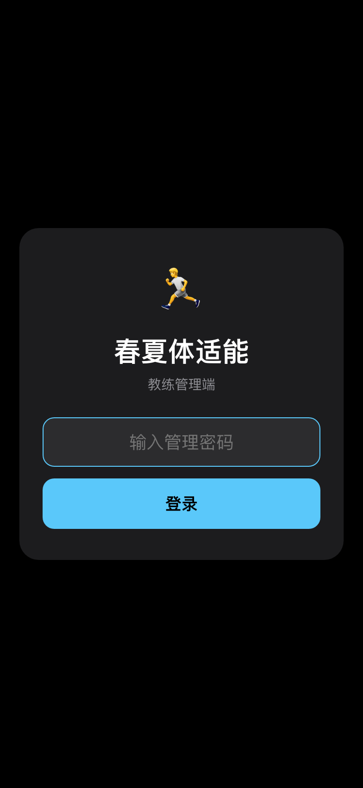
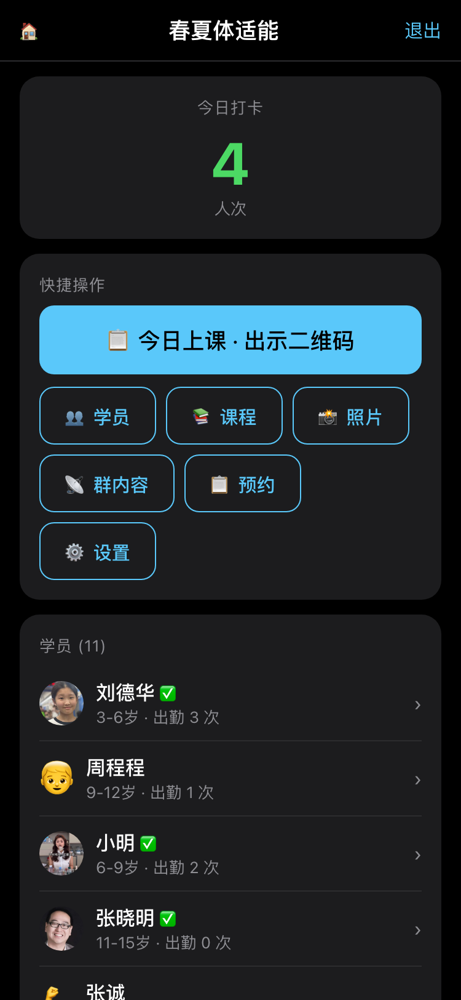
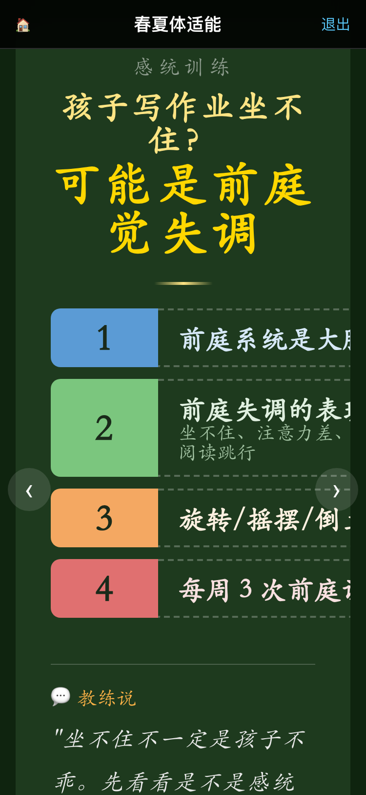
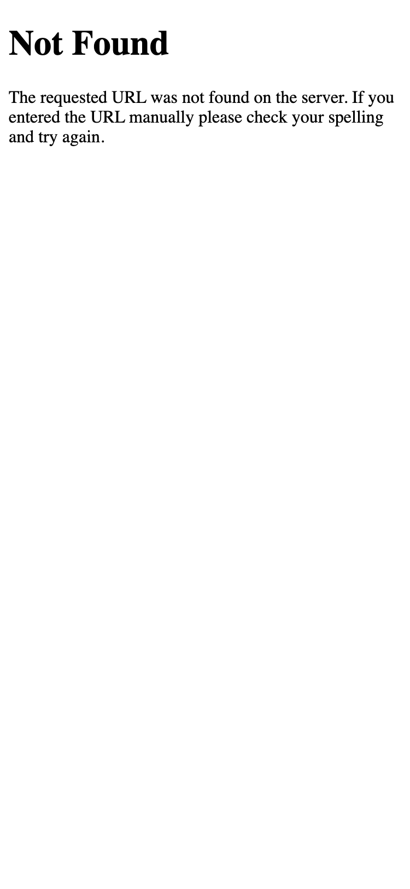
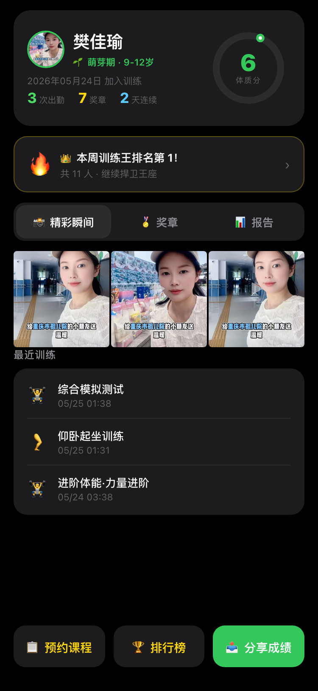
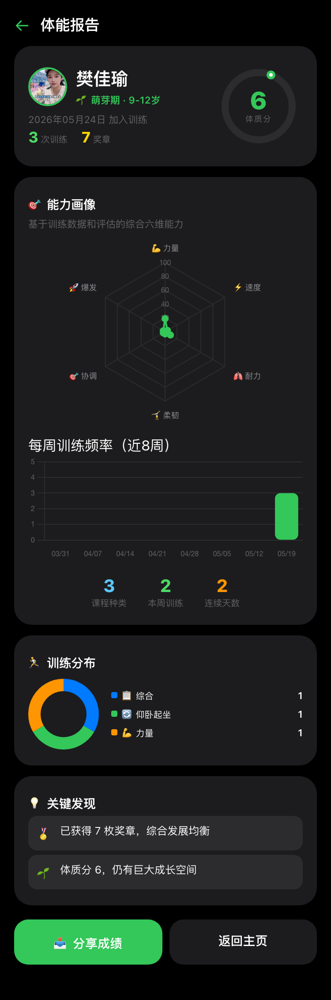
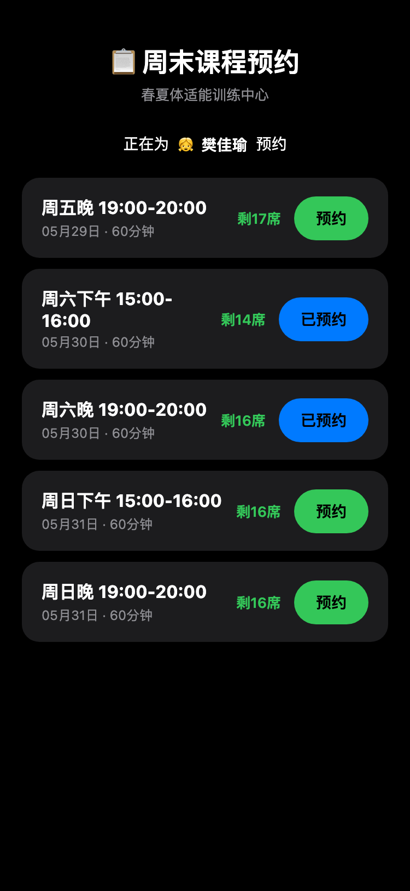
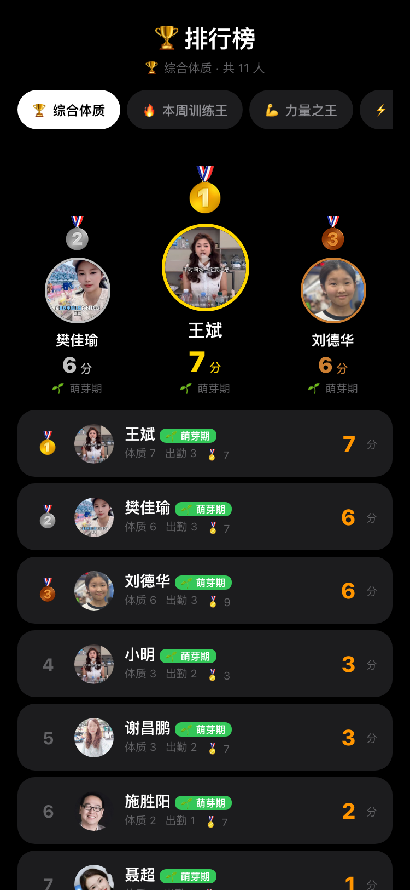
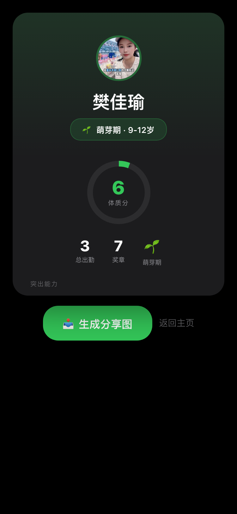

# 春夏体适能训练中心 · 使用说明

## 系统概览

```
教练手机浏览器 → 管理后台（密码登录）
                → 群内容中心（周报/进步之星/对决预告/预约管理）
家长微信扫码   → 打卡 + 查看孩子主页 + 排行榜 + 分享 + 预约课程
```

---

## 一、启动系统

```bash
cd /Volumes/增元/项目/fitness-h5
python3 -m pip install -r requirements.txt   # 首次
python3 app.py                               # 启动，默认端口 5050
```

打开浏览器访问 `http://localhost:5050`

> face_recognition 库安装较慢（需要编译 dlib），如果不用人脸识别可跳过：
> `python3 -m pip install flask flask-sqlalchemy qrcode[pil] pillow`

### 运行测试

```bash
python3 -m pip install pytest pytest-flask   # 首次
python3 -m pytest tests/ -v                  # 178 个测试用例
```

---

## 二、教练端 — 日常操作

### 登录

浏览器打开 `http://localhost:5050/login`，输入密码（默认 `coach123`）



### 仪表盘

登录后首页显示今日数据概览：打卡数、活跃学员、近期事件等。



### 上课打卡（每天 30 秒）

1. 首页点「今日上课」→ 选择今天的 SOP 课程
2. 屏幕上出现大大的二维码 → 放在前台桌上
3. 家长扫码完成打卡
4. 忘扫的学员：点下方学员名字手动补打卡
5. 家长扫码的打卡显示「⏳ 待确认」，点 ✓ 确认


### 群内容中心 — `http://localhost:5050/coach/content`

这是激活家长群的核心工具。每周七天，每天有对应的内容类型：

| 周几 | 内容 | 说明 |
|------|------|------|
| 周一 | 📊 周报战报 | 上周排名变动 + 本周之星 + 出勤统计 |
| 周二 | ⭐ 进步之星 | 进步最快 TOP 3 + 教练可手动加点评 |
| 周三 | ⚔️ 对决预告 | 分差接近的学员配对 → "周末谁能超越？" |
| 周四 | 📋 预约提醒 | 周末课程预约情况 + 剩余名额 |
| 周五 | 📋 上课提醒 | 今晚课程 + 注意事项 |
| 周六/日 | 📸 实时战报 | 今日打卡数 + 新纪录 + 训练照片 |

操作：点「预览/生成图片」→ 内容预览 → 截图 → 发微信群



### 预约管理 — `http://localhost:5050/coach/bookings`

按周末时段查看所有学员预约情况，每个时段显示预约名单和人数。

---

## 三、教练端 — 学员管理

### 学员列表

学员列表 → 查看/编辑/添加学员。



### 添加学员

学员列表 → 「+ 添加学员」→ 填姓名、年龄段、选头像 → 保存后自动生成个人二维码

### 录入评估

学员详情页 → 「+ 新评估」→ 填入坐位体前屈/立定跳远/折返跑/跳绳/仰卧起坐/平衡/体态/评语 → 保存
- 系统自动检查是否触发奖章（如跳绳破百、跳远180cm+）


### 上传照片 + 人脸识别

首页 → 「📸 照片」→ 选多张照片 → 上传
- 已录入人脸则自动识别归类；未识别照片可手动标记

### 颁发奖章

学员详情页 → 奖章区域 → 选择奖章 → 颁发

---

## 四、家长端操作

### 查看孩子主页

扫学员个人二维码 → 看到：
- 体力圆环（六维属性综合分）+ 段位 + 进度条
- 🏅 奖章墙（获得的所有奖章）
- 📸 训练照片（支持左右滑动浏览 + 一键生成小红书式分享卡）
- 📊 体能报告（4张 Chart.js 图表：趋势曲线/雷达图/柱状图/环形图）
- 📅 月度出勤日历
- 🕐 最近训练时间线
- 排行榜入口（显示孩子最佳排名维度）



### 体能报告

学员主页 → 下拉到「体能报告」区域，4 张图表展示各项体测数据变化。



### 上课打卡

扫教练展示的 SOP 课程二维码 → 点击自己孩子名字 → 打卡提交

### 课程预约

扫预约码或从主页进入 → `http://localhost:5050/booking?code=<学员码>`
- 显示本周末 5 个时段：周五晚/周六下午/周六晚/周日下午/周日晚
- 每个时段显示剩余名额
- 一键预约/取消



### 排行榜

主页点「排行榜」→ 10 个维度可选：
综合体质 / 本周训练王 / 力量之王 / 速度之星 / 耐力之王 / 柔韧之星 / 协调之星 / 爆发之王 / 奖章达人 / 进步之星



排行榜功能：
- **领奖台**：前三名展示照片/头像
- **个人排名卡**：显示自己的排名 + 与前一名的差距
- **对决挑战**：点击其他学员 → 弹出 VS 对比弹窗 → 四项数据对比 + 激励文案
- **分享卡片**：排行榜右上角 → 生成自己的排名分享图

### 分享到朋友圈

多个分享入口：
1. **主页** → 「分享成绩」→ 段位 + 体质分 + 属性
2. **排行榜** → 排名分享卡 → 3:4 竖版小卡片 → html2canvas 生成图片
3. **奖章详情** → 奖章 + 当天训练照片
4. **对决挑战** → 排行榜点对手 → VS 对比 → 可分享挑战卡



---

## 五、事件检测引擎

系统自动检测以下事件，为群内容提供素材：

| 事件 | 触发条件 |
|------|---------|
| 📈 排名上升 | 排名上升 ≥ 3 位 |
| 📉 排名下降 | 排名下降 ≥ 3 位 |
| 🎯 新纪录 | 某项评估创个人最佳 |
| 🎊 段位晋升 | 从萌芽→成长→突破→巅峰 |
| ⚠️ 连续中断 | 连续出勤本周中断（≥3天记录但本周未打卡） |
| 🎉 首次打卡 | 新学员第一次打卡（7天内有效） |
| 👋 回归 | 缺课 ≥ 14 天后重新出现 |
| 🏅 获得奖章 | 近 3 天内获得新奖章 |

代码位置：`events.py`（纯函数，可在 Flask 外独立调用）

---

## 六、段位系统

| 段位 | 分数 | 颜色 | 图标 |
|------|------|------|------|
| 萌芽期 | 0-59 | #34C759 绿 | 🌱 |
| 成长期 | 60-79 | #007AFF 蓝 | 🌿 |
| 突破期 | 80-89 | #FF9500 橙 | 🔥 |
| 巅峰期 | 90-100 | #FF3B30 红 | 👑 |

段位 = 六维属性平均值。每上一节课自动成长：

| 课程关键词 | 属性成长 |
|-----------|---------|
| 感统 | 🎯 协调 +8, 🤸 柔韧 +5 |
| 力量 | 💪 力量 +10 |
| 速度 | ⚡ 速度 +8, 🎯 协调 +3 |
| 协调 | 🎯 协调 +8, 🚀 爆发 +5 |
| 柔韧 | 🤸 柔韧 +10 |
| 爆发 | 🚀 爆发 +10, 💪 力量 +5 |
| 耐力 | 🫁 耐力 +10 |
| 跳绳 | 🎯 协调 +8, 🫁 耐力 +5 |
| 跑步 | ⚡ 速度 +8, 🫁 耐力 +5 |
| 跳远 | 🚀 爆发 +8, 💪 力量 +5 |
| 仰卧起坐 | 💪 力量 +5, 🫁 耐力 +5 |
| 综合模拟 | 全属性各 +3~4 |

---

## 七、奖章触发规则

**自动触发（打卡时检查）：**
- 出勤次数：1 / 10 / 30 / 50 / 100 次
- 连续出勤：7 / 14 / 30 天

**自动触发（评估时检查）：**
- 🪢 跳绳 ≥ 100 / ≥ 150
- 💪 仰卧起坐 ≥ 50
- 🤸 坐位体前屈 ≥ 15
- 🚀 立定跳远 ≥ 180 / ≥ 200
- ⚡ 折返跑 ≤ 8.0 秒

**手动颁发：**
- 感统达人 / 基础体能毕业 / 全项目A级 / 中考满分冲刺

---

## 八、二维码说明

| 码类型 | 谁扫 | 页面 |
|--------|------|------|
| SOP 课程码 | 家长 | 打卡确认页 |
| 学员个人码 | 家长 | 孩子主页（数据+奖章+照片+报告） |
| 教练后台 | 教练 | 登录后管理所有数据 |

---

## 九、项目文件结构

```
fitness-h5/
├── app.py              # Flask 应用入口
├── config.py           # 配置（数据库/密码/公网URL）
├── models.py           # 7 个数据模型
├── routes.py           # 所有路由（家长端 + 教练端）
├── events.py           # 事件检测引擎
├── content_engine.py   # 群内容引擎
├── share_hooks.py      # 分享钩子引擎
├── seed.py             # 预置课程 + 奖章模板
├── 需求文档.md          # 完整需求文档
├── 使用说明.md          # 本文件
├── CloudBase部署指南.md  # 云端部署指南
├── 测试用例.md          # 手动测试用例（90+ 项）
├── Dockerfile          # Docker 构建文件（CloudBase 部署用）
├── tests/              # 自动化测试（178 tests）
│   ├── conftest.py
│   ├── test_models.py
│   ├── test_events.py
│   ├── test_content_engine.py
│   ├── test_routes.py
│   ├── test_booking.py
│   └── test_share.py
├── templates/
│   ├── parent/         # 家长端 9 个模板
│   │   ├── home.html
│   │   ├── checkin.html
│   │   ├── leaderboard.html
│   │   ├── report.html
│   │   ├── rank_share.html
│   │   ├── challenge_share.html
│   │   ├── share.html
│   │   ├── badge_detail.html
│   │   ├── photo_share.html
│   │   └── booking.html
│   └── coach/          # 教练端 13 个模板
│       ├── base.html
│       ├── login.html
│       ├── dashboard.html
│       ├── today.html
│       ├── content.html
│       ├── bookings.html
│       ├── students.html
│       ├── student_detail.html
│       ├── student_form.html
│       ├── onboarding.html
│       ├── assessment_form.html
│       ├── courses.html
│       └── ...
└── static/
    ├── screenshots/    # 系统截图（本说明文档配图）
    └── uploads/
        ├── qrcodes/    # 自动生成的二维码
        └── photos/     # 训练照片 + 人脸数据
```

---

## 十、环境变量

`.env` 文件：

```
FITNESS_COACH_PASSWORD=coach123    # 教练登录密码
PORT=5050                          # 服务端口
DATABASE_URL=                      # 留空用 SQLite，填写用 PostgreSQL
PUBLIC_BASE_URL=http://xxx         # 公网地址（生成二维码用）
LLM_API_KEY=sk-xxx                 # DeepSeek API Key（用于 AI 生成内容）
LLM_BASE_URL=https://api.deepseek.com/v1
LLM_MODEL=deepseek-chat
```

---

## 十一、部署到腾讯云 CloudBase

详见 [CloudBase部署指南.md](CloudBase部署指南.md)

**快速概览：**

1. 腾讯云控制台开通 CloudBase + CFS 文件存储
2. 将项目代码推送到 Git 仓库
3. CloudBase 云托管自动检测 Dockerfile 构建镜像
4. 挂载 CFS 到 `/data` 实现 SQLite + 上传文件持久化
5. 配置环境变量 → 完成

**本地测试 Docker 构建：**

```bash
docker build -t fitness .
docker run -p 8080:8080 -e DATA_DIR=/data -v $(pwd)/local_data:/data fitness
```

文件路径：`/Volumes/增元/项目/fitness-h5/Dockerfile`
